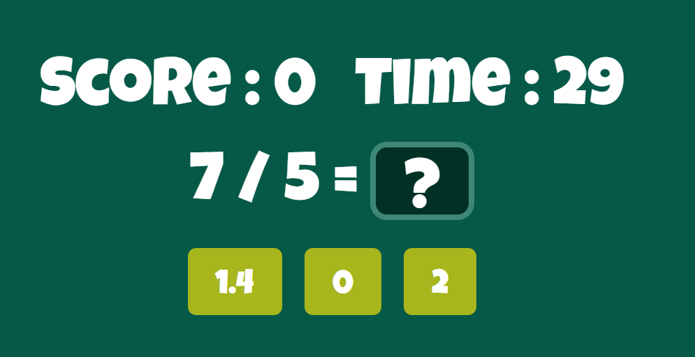

# Simple Math Quiz Game
This is a simple math quiz game. You can play this game to improve your math skills. This game is made with React and Tailwind CSS. This game is made for fun and learning purpose. You can play this game on your mobile phone or desktop. This game is fully responsive. 


## Live Demo
[Click here](https://math-quiz-seven.vercel.app) to play this game.


## Installation
Clone this repository using this command.
```bash
git clone https://github.com/AbdurRaahimm/mathQuiz.git
```
After cloning this repository run this command to install all dependencies.
```bash
npm install
```
or 
```bash
npm i
```
After installing all dependencies run this command to start the development server.
```bash
npm run dev
```
After running this command your development server will start on port 5173. Open your browser and go to http://localhost:5173 to play this game.


## Screenshots


  

## Features
- Addition Quiz
- Subtraction Quiz
- Multiplication Quiz
- Division Quiz
- Fully Responsive
- add timing and scoring system
- add sound effect if press wrong answer  


## Tools
- React
- Vite
- Tailwind CSS
- React Router


## Connect on Social Media
- [Twitter](https://twitter.com/AbdurRahim4G)
- [Instagram](https://www.instagram.com/abdurrahim4g/)
- [Facebook](https://www.facebook.com/Rahim72446)
- [LinkedIn](https://www.linkedin.com/in/abdur-rahim4g/)
- [YouTube](https://youtube.com/@AbdurRahimm)


